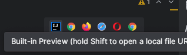
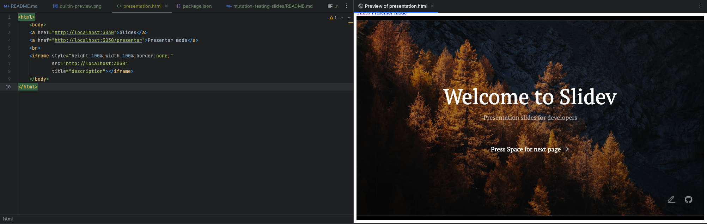

# mutation-testing
Materials to present Mutation testings principles

## Slides

Uses https://sli.dev/guide/install.html#starter-template.

### Run it

We use yarn to run the slides. Make sure your node version is >14.
See [Slides README](./mutation-testing-slides/README.md)

- Go inside [mutation-testing-slides](./mutation-testing-slides)
- Run `yarn slidev` or `yarn dev` (it will open the presentation in your browser)

### Share in IntelliJ

Thanks to [Presentation HTML file](./mutation-testing-slides/presentation.html), you can present your slides directly from IntelliJ

- Run Slidev as mentioned [here](#run-it)
- Open [presentation.html](./mutation-testing-slides/presentation.html) in IntelliJ
- Choose the built-in preview 

  

- And here is the result:

  
