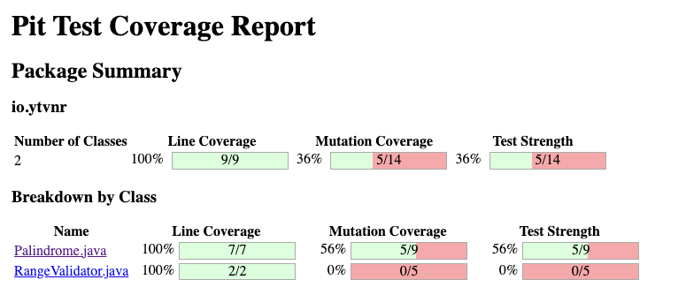
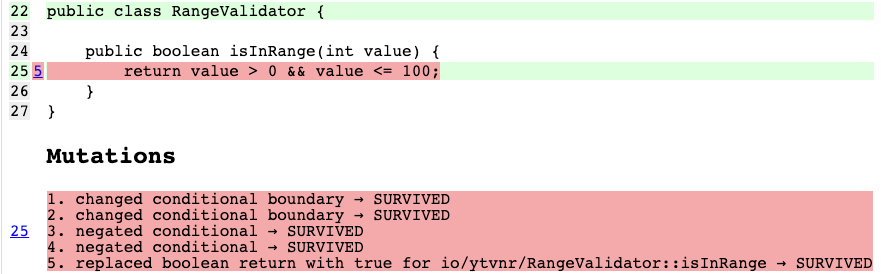

---
# try also 'default' to start simple
theme: seriph
colorSchema: dark
# apply any windi css classes to the current slide
class: 'text-center'
# https://sli.dev/custom/highlighters.html
highlighter: shiki
# show line numbers in code blocks
lineNumbers: false
fonts:
  sans: 'Robot'
  serif: 'Robot Slab'
# some information about the slides, markdown enabled
info: |
  ## Slidev Starter Template
  Presentation slides about Mutation Testing with PiTest

  Learn more at [Sli.dev](https://sli.dev)
# persist drawings in exports and build
drawings:
  persist: false
# page transition
transition: slide-left
# use UnoCSS
css: unocss
background: ./assets/xmen.jpeg
---

# Introduction to Mutation Testing

With PiTest.org

<div class="pt-12">
  <span @click="$slidev.nav.next" class="px-2 py-1 rounded cursor-pointer" hover="bg-white bg-opacity-10">
    Let's go <carbon:arrow-right class="inline"/>
  </span>
</div>

<div class="abs-br m-6 flex gap-2">
  <a href="https://github.com/ytvnr/mutation-testing" target="_blank" alt="GitHub"
    class="text-xl slidev-icon-btn opacity-50 !border-none !hover:text-white">
    <carbon-logo-github />
  </a>
</div>

<!--
The last comment block of each slide will be treated as slide notes. It will be visible and editable in Presenter Mode along with the slide. [Read more in the docs](https://sli.dev/guide/syntax.html#notes)
-->

---
transition: fade-out
---

# Unit testing and code coverage

A low code coverages indicates that code is not well tested... so it's probably unsafe or has a low quality.

## And what about high coverage?

It's pretty easy to improve coverage with tests passing through every line and branch of our code.

```java {all|3|all}
@Test
void fiftyShouldBeInRange() {
  cut.isInRange(50);
}
```


<br>
<br>
<br>
<br>
<br>

> An executed line of code is not a tested line of code.

---
transition: slide-up
layout: image-right
image: ./assets/mutant.jpeg
---

# What is Mutation Testing?

A good test is a test that fails when he should fail.

Mutation testing automatically modifies existing code in small ways, called mutation, then checks if our tests will fail.

If a mutation does not cause at least one test to fail, then it means the test is not written well enough or a test is missing.

---
transition: slide-up
layout: image-right
image: ./assets/mutant.jpeg
---

# What is Mutation Testing?

```java
int index = 0;
while(...) {
    ...;
    index++;
    if (index == 10) break;
}
```

becomes:

```java
int index = 0;
while(...) {
    ...;
    index++;
    if (index == 10) break;
}
```

---
transition: slide-up
layout: image-right
image: ./assets/kill-em.jpeg
---

# Dead mutant are good mutants

Our goal is to kill all the mutants.

If a Unit Test fails, it means the code modification is detected: **the mutant is killed**.

Else, the mutant survived, meaning it would not be detected if the case occurs in the real world.

<br>

**Mutation killing report provides you the Test Strength** (killed mutants / all mutants for which there was test coverage)


---
transition: fade
layout: fact
---

# PiTest

A state-of-the-art mutation testing system for Java and the JVM

<div class="abs-br m-6 flex gap-2">
  <a href="http://pitest.org/" target="_blank" alt="PiTest.org"
    class="text-xl slidev-icon-btn opacity-50 !border-none !hover:text-white">
    <span> http://pitest.org/ </span>
    <carbon-book />
  </a>
  <a href="https://github.com/hcoles/pitest" target="_blank" alt="PiTest"
    class="text-xl slidev-icon-btn opacity-50 !border-none !hover:text-white">
    <span> https://github.com/hcoles/pitest </span>
    <carbon-logo-github />
  </a>
</div>

<!--
It's a mutation testing system that helps us to automate the mutation testing and reporting
-->

---
transition: slide-up
---

# Mutators

- ❓ **CONDITIONAL_BOUNDARIES** - replace relational operator `<, <=, >, >=`
- 📭 **EMPTY_RETURNS** - replaces return values with an ‘empty’ value for that type (e.g. empty strings, empty Optionals, zero for integers)
- ❌ **FALSE_RETURNS** - replaces primitive and boxed boolean return values with false
- ✅ **TRUE_RETURNS** - replaces primitive and boxed boolean return values with true
- 🕳️ **NULL_RETURNS** - replaces return values with null (unless annotated with NotNull or mutable by EMPTY_RETURNS)
- ➕ **INCREMENTS** - replaces increments (++) with decrements (--) and vice versa
- ➖ **INVERT_NEGS** - inverts negation of integer and floating point numbers (e.g. -1 to 1)
- 🧮 **MATH** - replaces binary arithmetic operations with another operation (e.g. + to -)
- ❗️ **NEGATIVE_CONDITIONALS** - negates conditionals (e.g. == to !=)
- 0️⃣ **PRIMITIVE_RETURNS** - replaces primitive return values with 0 (unless they already return zero)
- 🗑️ **VOID_METHOD_CALLS** - removes method calls to void methods

For the full list: https://pitest.org/quickstart/mutators/

<!--
Math: arithmetic operators, bitwise operators, shift operators 
-->

---
transition: slide-up
---

# Configuration

```xml
 <plugin>
  <groupId>org.pitest</groupId>
  <artifactId>pitest-maven</artifactId>
  <version>${pitest-parent.version}</version>
  <configuration>
    <targetClasses>
      <param>io.ytvnr.*</param>
    </targetClasses>
    <targetTests>
      <param>io.ytvnr.*</param>
    </targetTests>
  </configuration>
  <dependencies>
    <dependency>
      <groupId>org.pitest</groupId>
      <artifactId>pitest-junit5-plugin</artifactId>
      <version>${pitest-junit5-plugin.version}</version>
    </dependency>
  </dependencies>
</plugin>
```

For more details: https://pitest.org/quickstart/maven/

---
transition: slide-up
layout: image
image: ./assets/kill-the-mutants.jpeg
---


<!--
let's try to seek and destroy the mutants

Show the classes we have, and the tests.
Generate coverage with jacoco
Generate coverage with PIT
-->

---
transition: fade-out
---

# Interpreting the results



---
transition: fade-out
---

# Interpreting the results



---
transition: fade-out
---

# Mutant states

- 💗 **Survived** - The mutant survived the mutator. Test is not written well enough
- 💀 **Killed** - Congratulations! 🎉
- 👀 **No coverage** - Same as Survived, but there was no test exercising the mutated line of code
- 💥 **Non viable** - Mutation that could not be loaded by the JVM as the bytecode is invalid. (PIT tries to minimize it)
- ⌛️ **Timed out** - May happen if mutator changes the exit condition of loop, making it infinite
- 🧠 **Memory error** - Might occur if a mutation increases the amount of memory used by the system.
- 🏃 **Run error** - something went wrong when trying to test the mutation

<!--
For RangeValidatorTest

first, just add assertions and run `task mutate`
then, add case for 0 (false) and 100 (true)

For Palindrome

just add a case when it's not a palindrome
-->

---
class: px-20
---

# Pros and cons of Mutation Testing

| **Pros**                                                      | **Cons**                                                                                       |
|---------------------------------------------------------------|------------------------------------------------------------------------------------------------|
| Cover entire source code and detects not well-tested parts    | Expensive and time-consuming process because mutant programs should be generated independently |
| Detects high quality bugs, hard to find with usual testing    | Being complicated & long to perform, should be automated (thanks PiTest!)                      |
| Reveals hidden faults in code such as source code ambiguities | Can't be used for black-box testing (needs to change source code)                              |
| Customers get the most stable and reliable system             | Testers needs programming knowledge                                                            |
| Loopholes in test can be identified                           | Needs some tuning: mutate high value code (not pojos)                                          |


---
transition: fade
---

# Summary

- Mutation testing is time-consuming, it requires automation
- Mutation testing is the most comprehensive technique to test any program
- Mutation testing is a unit testing method
- It uses fault injection to generate mutants
- Other systems exists: µJava, Jester, Jumble, etc.

## To go further

- [Don't let your code dry](http://blog.pitest.org/dont-let-your-code-dry/)
- [PiTest PR setup](https://blog.pitest.org/pitest-pr-setup/)

---
layout: image
class: text-center align-middle
image: ./assets/victory.jpeg
---

[//]: # (I can do CSS, but it's so simple with <br> 😅)
<br>
<br>
<br>
<br>
<br>
<br>
<br>
<br>
<br>
<br>
<br>
<br>
<br>
<br>
<br>

[https://github.com/ytvnr/mutation-testing](https://github.com/ytvnr/mutation-testing)
